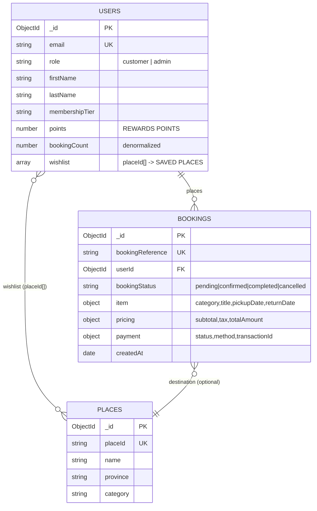

# MongoDB Schema — CRM Dashboard (`goThailand-Wa`)

Schema สำหรับการ์ด 4 ใบ: `upcomingTrips` · `totalBookings` · `rewardsPoints` · `savedPlaces`

**สถานะปัจจุบัน:** frontend รันด้วย mock (`USE_MOCK = true` ใน `src/services/dashboardService.js`)
เอกสารนี้คือ schema ปลายทางเมื่อต่อ DB จริง

---

## 0. ของที่มีอยู่แล้ว vs ต้องสร้าง

`landing/src/server/models/` มี `User.ts` / `Customer.ts` / `Admin.ts` แล้ว
และ `landing/TODO_BACKEND.md` ระบุไว้ว่ายังไม่มี `Booking` — ตรงกับที่ต้องเติม

| การ์ด | ที่มาของค่า | ต้องสร้างใหม่ไหม |
|---|---|---|
| REWARDS POINTS | `Customer.points` | ❌ มีแล้ว |
| SAVED PLACES | `Customer.wishlist.length` | ❌ มีแล้ว (แต่ควรมี `Place` มา join — ดูข้อ 3) |
| TOTAL BOOKINGS | นับจาก `bookings` | ✅ สร้าง `Booking` |
| UPCOMING TRIPS | นับจาก `bookings` | ✅ สร้าง `Booking` |

> **กฎ:** ห้ามตั้งชื่อ field ใหม่ทับของเดิม — ใช้ `points`, `bookingCount`, `wishlist`,
> `membershipTier` ตาม `Customer.ts` เป๊ะ ไม่ใช้ `rewards.points`

---

## 1. ER Diagram



---

## 2. `bookings` collection (สร้างใหม่)

### Document ตัวอย่าง
```json
{
  "_id": { "$oid": "66ce7890f1a2b3c4d5e6f7a8" },
  "bookingReference": "GT-CR-2026-00128",
  "userId": { "$oid": "66ce7000f1a2b3c4d5e6f700" },

  "item": {
    "category": "car_rental",
    "title": "Toyota Fortuner 2.8 V 4WD",
    "image": "/images/car_rental/gt-cr-2026-00128.png",
    "placeId": "wat-arun-bkk",
    "pickupLocation": "Suvarnabhumi Airport (BKK)",
    "dropoffLocation": "Suvarnabhumi Airport (BKK)",
    "pickupDate": { "$date": "2026-09-11T02:00:00.000Z" },
    "returnDate": { "$date": "2026-09-15T02:00:00.000Z" },
    "pricePerDay": 2500,
    "totalDays": 4
  },

  "pricing": {
    "subtotal": 10000,
    "tax": 700,
    "discount": 0,
    "totalAmount": 10700,
    "currency": "THB"
  },

  "customerInfo": {
    "fullName": "Somchai Jaidee",
    "email": "somchai@example.com",
    "phone": "081-234-5678"
  },

  "payment": {
    "status": "paid",
    "method": "credit_card",
    "transactionId": "TXN-2026-00128",
    "paidAt": { "$date": "2026-08-27T13:30:00.000Z" }
  },

  "bookingStatus": "confirmed",
  "pointsEarned": 1070,
  "createdAt": { "$date": "2026-08-27T13:30:00.000Z" },
  "updatedAt": { "$date": "2026-08-27T13:30:00.000Z" }
}
```

### Mongoose model — `landing/src/server/models/Booking.ts`
```ts
import { Schema, model, models, Document, Model, Types } from 'mongoose';

export type BookingStatus = 'pending' | 'confirmed' | 'completed' | 'cancelled';
export type BookingCategory = 'car_rental' | 'tour' | 'hotel' | 'package';
export type PaymentStatus = 'unpaid' | 'paid' | 'refunded' | 'failed';

export interface IBooking extends Document {
  bookingReference: string;
  userId: Types.ObjectId;
  item: {
    category: BookingCategory;
    title: string;
    image?: string;
    placeId?: string;
    pickupLocation: string;
    dropoffLocation?: string;
    pickupDate: Date;
    returnDate: Date;
    pricePerDay: number;
    totalDays: number;
  };
  pricing: {
    subtotal: number;
    tax: number;
    discount: number;
    totalAmount: number;
    currency: string;
  };
  customerInfo: { fullName: string; email: string; phone?: string };
  payment: {
    status: PaymentStatus;
    method?: string;
    transactionId?: string;
    paidAt?: Date;
  };
  bookingStatus: BookingStatus;
  pointsEarned: number;
  createdAt: Date;
  updatedAt: Date;
}

const itemSchema = new Schema(
  {
    category: {
      type: String,
      enum: ['car_rental', 'tour', 'hotel', 'package'],
      required: true
    },
    title: { type: String, required: true, trim: true },
    image: { type: String },
    placeId: { type: String, index: true, sparse: true },
    pickupLocation: { type: String, required: true, trim: true },
    dropoffLocation: { type: String, trim: true },
    pickupDate: { type: Date, required: true },
    returnDate: { type: Date, required: true },
    pricePerDay: { type: Number, required: true, min: 0 },
    totalDays: { type: Number, required: true, min: 1 }
  },
  { _id: false }
);

const pricingSchema = new Schema(
  {
    subtotal: { type: Number, required: true, min: 0 },
    tax: { type: Number, default: 0, min: 0 },
    discount: { type: Number, default: 0, min: 0 },
    totalAmount: { type: Number, required: true, min: 0 },
    currency: { type: String, default: 'THB', uppercase: true }
  },
  { _id: false }
);

const paymentSchema = new Schema(
  {
    status: {
      type: String,
      enum: ['unpaid', 'paid', 'refunded', 'failed'],
      default: 'unpaid'
    },
    method: { type: String },
    transactionId: { type: String },
    paidAt: { type: Date }
  },
  { _id: false }
);

const bookingSchema = new Schema<IBooking>(
  {
    bookingReference: {
      type: String,
      required: true,
      unique: true,
      uppercase: true,
      trim: true
    },
    userId: { type: Schema.Types.ObjectId, ref: 'User', required: true },
    item: { type: itemSchema, required: true },
    pricing: { type: pricingSchema, required: true },
    customerInfo: {
      fullName: { type: String, required: true },
      email: { type: String, required: true, lowercase: true },
      phone: { type: String }
    },
    payment: { type: paymentSchema, default: () => ({}) },
    bookingStatus: {
      type: String,
      enum: ['pending', 'confirmed', 'completed', 'cancelled'],
      default: 'pending',
      index: true
    },
    pointsEarned: { type: Number, default: 0, min: 0 }
  },
  { timestamps: true, collection: 'bookings' }
);

// --- Indexes ที่ dashboard ใช้จริง ---
// การ์ด UPCOMING TRIPS: userId + status + pickupDate
bookingSchema.index({ userId: 1, bookingStatus: 1, 'item.pickupDate': 1 });
// การ์ด TOTAL BOOKINGS + list เรียงใหม่สุด
bookingSchema.index({ userId: 1, createdAt: -1 });

// returnDate ต้องไม่มาก่อน pickupDate
bookingSchema.pre('validate', function (next) {
  if (this.item?.returnDate < this.item?.pickupDate) {
    return next(new Error('returnDate ต้องไม่มาก่อน pickupDate'));
  }
  next();
});

export const Booking: Model<IBooking> =
  models.Booking || model<IBooking>('Booking', bookingSchema);
export default Booking;
```

### Validation rules
| Field | กติกา |
|---|---|
| `bookingReference` | unique, uppercase, รูปแบบ `GT-{CR\|TR\|HT\|PK}-{YYYY}-{NNNNN}` |
| `bookingStatus` | 4 ค่าเท่านั้น — `cancelled` ไม่ถูกนับในทุกการ์ด |
| `item.returnDate` | ต้อง `>= pickupDate` (pre-validate hook) |
| `pricing.totalAmount` | ควรเท่ากับ `subtotal + tax - discount` |
| `payment.status` | `refunded` มักมาคู่กับ `bookingStatus: cancelled` |

---

## 3. `places` collection (สร้างใหม่ — optional)

`Customer.wishlist` เป็น `string[]` เก็บแค่ `placeId` → นับจำนวนได้เลย
แต่ถ้าอยากโชว์ชื่อ/จังหวัด/รูปตอนคลิกการ์ด ต้องมี collection นี้มา join

```json
{
  "_id": { "$oid": "66d0aa11f1a2b3c4d5e6f801" },
  "placeId": "wat-arun-bkk",
  "name": "Wat Arun",
  "nameTh": "วัดอรุณราชวราราม",
  "province": "Bangkok",
  "category": "temple",
  "image": "/images/places/wat-arun.png",
  "coordinates": { "lat": 13.7437, "lng": 100.4889 },
  "isActive": true
}
```

```ts
const placeSchema = new Schema({
  placeId:   { type: String, required: true, unique: true, lowercase: true, trim: true },
  name:      { type: String, required: true, trim: true },
  nameTh:    { type: String, trim: true },
  province:  { type: String, required: true, trim: true, index: true },
  category:  { type: String, enum: ['temple','beach','nature','heritage','market','city'], required: true },
  image:     { type: String },
  coordinates: { lat: Number, lng: Number },
  isActive:  { type: Boolean, default: true }
}, { timestamps: true, collection: 'places' });
```

> **ทางเลือกที่แข็งแรงกว่า:** ถ้าอยากรู้ว่า bookmark เมื่อไหร่ / เรียงตามเวลาบันทึก
> ให้แยกเป็น collection `savedPlaces` (`{ userId, placeId, createdAt }`
> + compound unique index `{ userId: 1, placeId: 1 }` กันซ้ำ) แทนการเก็บ array ใน user
> — array โตไม่จำกัดและใส่ timestamp ต่อรายการไม่ได้
> แต่ตอนนี้ `Customer.wishlist` มีอยู่แล้ว ใช้ไปก่อนได้

---

## 4. Query ที่ dashboard ใช้

### 4.1 นับ 2 การ์ดจาก `bookings` ด้วย `$facet` (query เดียว)
```js
const now = new Date();

const [agg] = await Booking.aggregate([
  { $match: { userId: new Types.ObjectId(userId) } },
  {
    $facet: {
      upcoming: [
        { $match: { bookingStatus: 'confirmed', 'item.pickupDate': { $gt: now } } },
        { $count: 'n' }
      ],
      total: [
        { $match: { bookingStatus: { $ne: 'cancelled' } } },
        { $count: 'n' }
      ]
    }
  }
]);

const upcomingTrips = agg.upcoming[0]?.n ?? 0;
const totalBookings = agg.total[0]?.n ?? 0;
```

### 4.2 อีก 2 การ์ดจาก `users` (ไม่ต้องแตะ bookings)
```js
const customer = await Customer.findById(userId)
  .select('firstName lastName membershipTier points wishlist')
  .lean();

const rewardsPoints = customer?.points ?? 0;
const savedPlaces   = customer?.wishlist?.length ?? 0;
```

### 4.3 Response ที่ frontend รออยู่แล้ว
```json
{
  "stats": {
    "upcomingTrips": 2,
    "totalBookings": 12,
    "rewardsPoints": 4500,
    "savedPlaces": 8
  },
  "user": {
    "firstName": "Somchai",
    "lastName": "Jaidee",
    "membershipTier": "gold"
  }
}
```
> รูปนี้ตรงกับที่ `fetchDashboardStats()` / `fetchCurrentUser()` คาดไว้แล้ว
> — สลับ `USE_MOCK = false` แล้วใช้ได้ทันที

---

## 5. Endpoints

| Method | Path | คืนค่า |
|---|---|---|
| GET | `/api/dashboard/:userId` | `{ stats, user }` (ข้อ 4.3) |
| GET | `/api/trips/:userId?filter=upcoming` | `{ trips: Booking[] }` เรียง `item.pickupDate` asc |
| GET | `/api/saved-places/:userId` | `{ places: Place[] }` (join wishlist) |
| POST | `/api/saved-places` | `$addToSet` เข้า `wishlist` (กันซ้ำ) |
| DELETE | `/api/saved-places/:placeId` | `$pull` ออกจาก `wishlist` |

**Error contract:** `{ "error": { "code": "...", "message": "..." } }`

| HTTP | code |
|---|---|
| 400 | `INVALID_USER_ID` (ObjectId ไม่ถูกรูป) |
| 401 | `UNAUTHORIZED` (ไม่มี Bearer token) |
| 404 | `USER_NOT_FOUND` |
| 500 | `INTERNAL_ERROR` |

---

## 6. เรื่องที่ต้องระวัง

**1. `bookingCount` เป็นค่า denormalized — อย่าเอามาโชว์บนการ์ด**
`Customer.bookingCount` มีอยู่แล้วใน `landing` แต่ถ้ามีการ cancel/refund แล้วลืมอัปเดต
ค่าจะเพี้ยน — การ์ด TOTAL BOOKINGS ต้อง**นับสดจาก `bookings`** เสมอ
(`computeStats` ใน service ทำแบบนี้อยู่แล้ว) ใช้ `bookingCount` ได้แค่กรณีต้องการเร็วมากๆ

**2. `points` ต้องเก็บจริง ห้ามคำนวณสด**
มีทั้ง earn และ redeem — คำนวณย้อนจาก `bookings` ไม่ได้
`Booking.pointsEarned` เก็บไว้เพื่อ**ตรวจสอบย้อนหลัง** ไม่ใช่เพื่อ sum มาแทน `points`
กติกาสะสมที่ใช้ตอนนี้: `floor(pricing.totalAmount / 10)` เมื่อ `payment.status === 'paid'`

**3. Timezone**
`item.pickupDate` เก็บเป็น UTC (`$date`) แต่ผู้ใช้คิดเป็นเวลาไทย (UTC+7)
การเทียบ `> now` สำหรับ "ทริปที่จะถึง" ควรเทียบที่ขอบวันตามเวลาไทย
ไม่ใช่ UTC เที่ยงคืน ไม่งั้นทริปวันนี้ตอนเช้าอาจหลุดออกจากการ์ด

**4. `_id` vs `bookingReference`**
`bookingReference` คือรหัสที่ลูกค้าเห็น/ใช้ค้นหา (`GT-CR-2026-00128`)
อย่าเอา `_id` ไปโชว์หรือใส่ใน URL

---

## 7. ทำอะไรต่อเพื่อ go-live

1. สร้าง `landing/src/server/models/Booking.ts` (โค้ดข้อ 2)
2. สร้าง `Place.ts` ถ้าต้องการหน้ารายการที่บันทึก (ข้อ 3)
3. ทำ route `GET /api/dashboard/:userId` ใน `landing/src/app/api/` ให้คืนตามข้อ 4.3
4. seed ข้อมูลจาก `goThailand-Wa/src/mock/*.js` (โครงตรงกันแล้ว)
5. `USE_MOCK = false` + ส่ง `userId` จาก `GET /api/auth/me` แทน `MOCK_USER_ID`
6. ถ้า backend อยู่คนละ origin ต้องตั้ง proxy `/api` ใน `vite.config.js`

**component ฝั่ง React ไม่ต้องแก้เลย** — mock อยู่หลัง service layer ทั้งหมด
