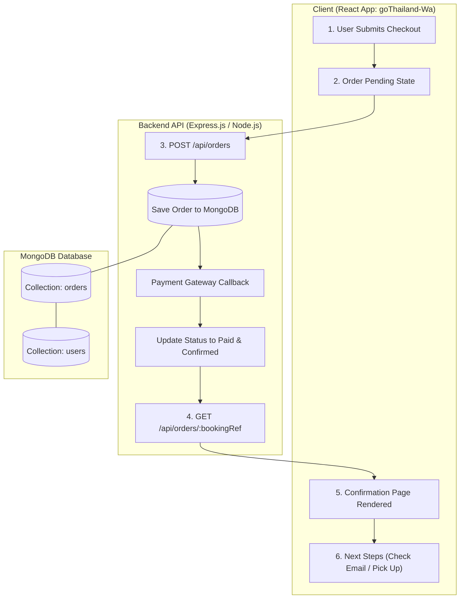
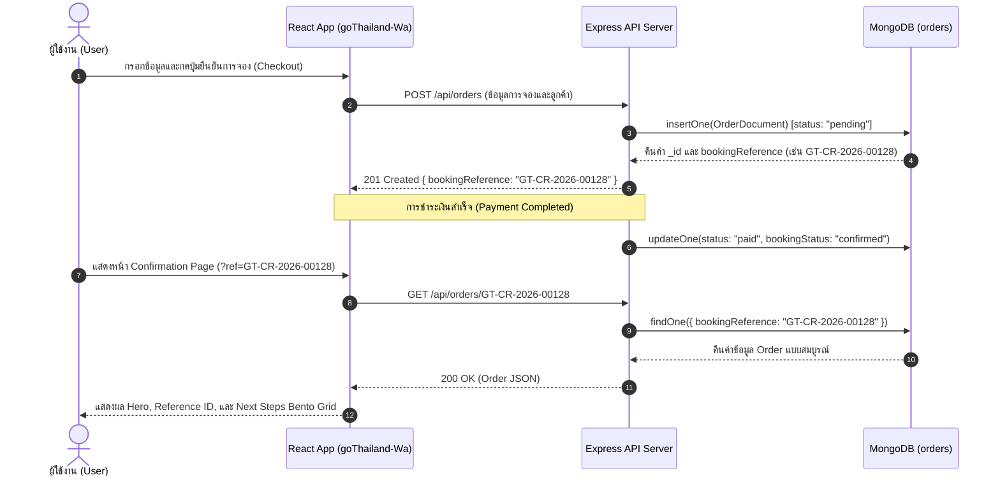
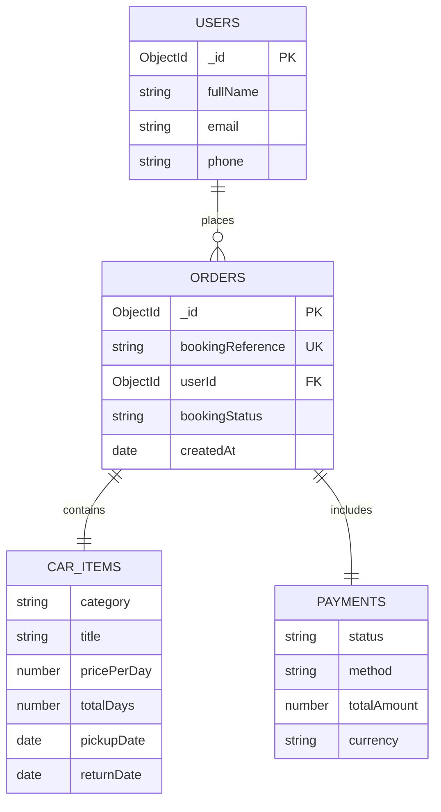

# แผนการนำ MongoDB มาใช้กับหน้า Order & Booking Confirmation (`goThailand-Wa`)

เอกสารนี้สรุปสถาปัตยกรรม แผนภาพกระบวนการทำงาน (Flowchart & Sequence Diagram) และโครงสร้างฐานข้อมูล **MongoDB** สำหรับระบบคำสั่งซื้อและการจองของโปรเจกต์ `goThailand-Wa`

---

## 1. แผนภาพกระบวนการทำงานของ Order (Order Data Flow Diagram)

### 1.1 กระบวนการทำงานระดับระบบ (System Architecture Flowchart)



---

### 1.2 ลำดับการส่งข้อมูล (Order Processing Sequence Diagram)



---

## 2. แผนภาพความสัมพันธ์ของข้อมูล (Data Relationship & ER Diagram)



---

## 3. โครงสร้างฐานข้อมูล (MongoDB Schema: `orders` collection)

ตัวอย่างโครงสร้าง Document สำหรับเก็บข้อมูลการจองรถเช่า/การสั่งซื้อ:

```json
{
  "_id": "66ce7890f1a2b3c4d5e6f7a8",
  "bookingReference": "GT-CR-2026-00128",
  "userId": "66ce7000f1a2b3c4d5e6f700",
  "item": {
    "category": "car_rental",
    "title": "Toyota Fortuner 2.8 V 4WD",
    "image": "/images/cars/fortuner.png",
    "pickupLocation": "Suvarnabhumi Airport (BKK)",
    "dropoffLocation": "Suvarnabhumi Airport (BKK)",
    "pickupDate": "2026-09-01T09:00:00.000Z",
    "returnDate": "2026-09-05T18:00:00.000Z",
    "pricePerDay": 2500,
    "totalDays": 4
  },
  "pricing": {
    "subtotal": 10000,
    "tax": 700,
    "discount": 500,
    "totalAmount": 10200,
    "currency": "THB"
  },
  "customerInfo": {
    "fullName": "Somchai Jaidee",
    "email": "somchai@example.com",
    "phone": "081-234-5678",
    "idPassport": "1100800123456"
  },
  "payment": {
    "status": "paid",
    "method": "credit_card",
    "transactionId": "TXN-99887766",
    "paidAt": "2026-08-27T13:30:00.000Z"
  },
  "bookingStatus": "confirmed",
  "createdAt": "2026-08-27T13:30:00.000Z",
  "updatedAt": "2026-08-27T13:30:00.000Z"
}
```

---

## 4. รายละเอียดไฟล์และส่วนประกอบ (Files & Components Structure)

### 4.1 ฝั่ง Backend (Express + Mongoose)
- `server/config/db.js`: ตั้งค่าการเชื่อมต่อ MongoDB ผ่าน Mongoose (`process.env.MONGODB_URI`)
- `server/models/Order.js`: นิยาม Mongoose Order Schema พร้อม Index ที่ `bookingReference`
- `server/controllers/orderController.js`:
  - `createOrder`: บันทึกคำสั่งซื้อใหม่และสร้างรหัส `bookingReference`
  - `getOrderByRef`: ดึงข้อมูลคำสั่งซื้อด้วย `bookingReference`
- `server/routes/orderRoutes.js`: กำหนด API endpoints (`GET /api/orders/:bookingRef`, `POST /api/orders`)
- `server/seed/seedOrders.js`: Script สร้างข้อมูลจำลองคำสั่งซื้อสำหรับทดสอบ

### 4.2 ฝั่ง Frontend (`src/`)
- `src/services/api.js`: ฟังก์ชันสืบค้นข้อมูล order จาก backend (`fetchOrderByRef`)
- `src/components/BookingSuccessHero.jsx`: รับค่า props ข้อมูลการจองจริงมาแสดงผล
- `src/components/NextStepsBento.jsx`: แสดงขั้นตอนถัดไปตามสถานะของ Order
- `src/App.jsx`: ดึงรหัสการจองจาก URL และดึงข้อมูลจริงจาก MongoDB API

---

## 5. ลำดับขั้นตอนการพัฒนา (Implementation Phases)

1. **Phase 1: ตั้งค่า Backend & MongoDB**:
   - ติดตั้ง `express`, `mongoose`, `dotenv`, `cors`
   - สร้างไฟล์เชื่อมต่อ DB และ Schema ของ `Order`
2. **Phase 2: พัฒนา API & Data Seeding**:
   - สร้าง API Endpoint สำหรับ Query และ Create Order
   - เพิ่มข้อมูลตัวอย่างลงใน MongoDB
3. **Phase 3: เชื่อมต่อ Frontend**:
   - ปรับแต่ง React Component ใน `goThailand-Wa` ให้แสดงผล Dynamic Data
4. **Phase 4: ทดสอบระบบ (Testing & Verification)**:
   - ทดสอบสร้าง Order และดึงข้อมูลแสดงผลบน UI
