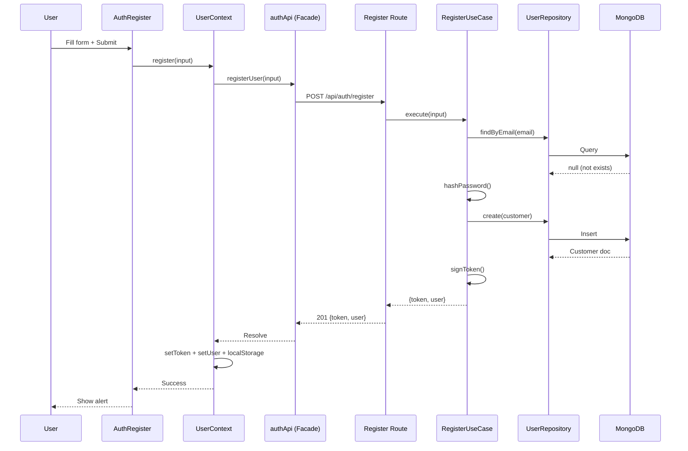
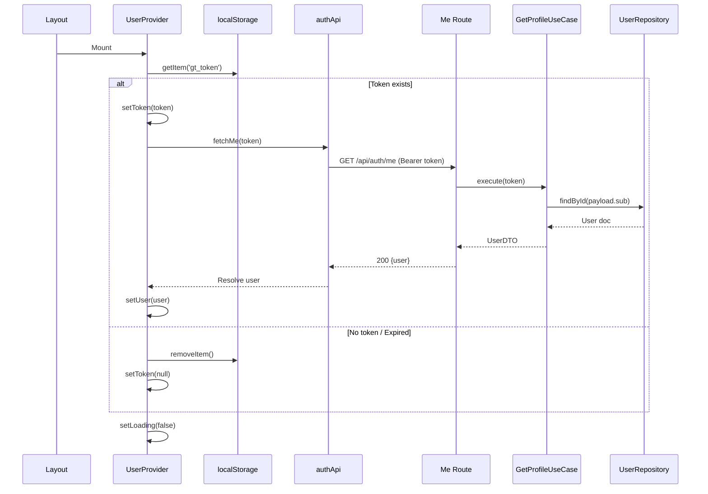

# Go Thailand — User Side Design System (Design Patterns Edition)

> Formal design pattern documentation for the User/Customer domain
> Based on `react-crm-lifecycle` skill + actual codebase implementation

---

## 1. Architectural Pattern: **Clean Architecture + Layered Architecture**

```
┌─────────────────────────────────────────────────────────────────────────────┐
│                        PRESENTATION LAYER (React)                           │
│  ┌─────────────┐ ┌─────────────┐ ┌─────────────┐ ┌─────────────┐          │
│  │  Pages      │ │ Components  │ │  Contexts   │ │   Hooks     │          │
│  │ (Routes)    │ │  (UI)       │ │ (State)     │ │  (Logic)    │          │
│  └──────┬──────┘ └──────┬──────┘ └──────┬──────┘ └──────┬──────┘          │
│         │               │               │               │                  │
│         └───────────────┼───────────────┼───────────────┘                  │
│                         ▼                                               │
│              ┌─────────────────────┐                                   │
│              │   APPLICATION LAYER │  ← Use Cases / Orchestrators       │
│              │  (UserContext,      │     - LoginUseCase                 │
│              │   API Facade)       │     - RegisterUseCase              │
│              └──────────┬──────────┘     - ResetPasswordUseCase        │
│                         │               - AddToCartUseCase              │
│                         ▼                                               │
│              ┌─────────────────────┐                                   │
│              │   DOMAIN LAYER      │  ← Entities, Value Objects,      │
│              │  (Models, Types)    │     Domain Events, Repository    │
│              │                     │     Interfaces                    │
│              └──────────┬──────────┘                                   │
│                         │                                               │
└─────────────────────────┼───────────────────────────────────────────────┘
                          ▼
┌─────────────────────────────────────────────────────────────────────────────┐
│                      INFRASTRUCTURE LAYER (Next.js + MongoDB)              │
│  ┌─────────────┐ ┌─────────────┐ ┌─────────────┐ ┌─────────────┐          │
│  │ API Routes  │ │ Repository  │ │  External   │ │  Config     │          │
│  │ (Controllers)│ │ Impl (Mongoose)│ Services   │ │  (Env)      │          │
│  └─────────────┘ └─────────────┘ └─────────────┘ └─────────────┘          │
└─────────────────────────────────────────────────────────────────────────────┘
```

**Dependency Rule:** Inner layers never depend on outer layers. Dependencies point inward via interfaces.

---

## 2. Design Patterns Used

### 2.1 **Repository Pattern** (Data Access Abstraction)

```typescript
// Domain Layer — Interface (Contract)
interface IUserRepository {
  findByEmail(email: string): Promise<User | null>;
  findById(id: string): Promise<User | null>;
  create(user: User): Promise<User>;
  update(user: User): Promise<User>;
}

// Infrastructure Layer — Implementation
class MongooseUserRepository implements IUserRepository {
  async findByEmail(email: string) {
    return UserModel.findOne({ email }).exec();
  }
  // ...
}

// Application Layer — Uses interface, not implementation
class LoginUseCase {
  constructor(private userRepo: IUserRepository) {}
  async execute(email: string, password: string) {
    const user = await this.userRepo.findByEmail(email);
    // ...
  }
}
```

**Implementation in codebase:**
- `src/server/models/User.ts` + `Customer.ts` + `Admin.ts` = Repository implementations via Mongoose
- API routes act as **Repository Consumers** (Controllers)
- `src/server/api/*.ts` (frontend) = **Repository Facade** for UI

---

### 2.2 **Facade Pattern** (API Layer)

```typescript
// src/server/api/auth.ts — Unified interface for all auth operations
export const authApi = {
  register: (input: RegisterInput) => fetch('/api/auth/register', ...),
  login:    (input: LoginInput)    => fetch('/api/auth/login', ...),
  me:       (token: string)        => fetch('/api/auth/me', ...),
  forgot:   (email: string)        => fetch('/api/auth/forgot-password', ...),
  reset:    (token: string, pwd: string) => fetch('/api/auth/reset-password', ...),
};

// UI Components only know this facade
const { register } = useUser(); // internally calls authApi.register()
```

**Benefits:**
- Single entry point for all auth API calls
- Easy to swap implementation (REST → GraphQL → tRPC)
- Centralized error handling, headers, base URL

---

### 2.3 **Provider Pattern / Context Pattern** (Global State)

```typescript
// src/contexts/UserContext.tsx
const UserContext = createContext<UserContextValue | undefined>(undefined);

export function UserProvider({ children }) {
  const [state, setState] = useState(initialState);
  // ... business logic methods
  return <UserContext.Provider value={{ state, actions }}>{children}</UserContext.Provider>;
}

// Consumption
const { user, token, login, logout } = useUser(); // Hook wrapper
```

**Characteristics:**
- **Singleton per app** (wrapped at layout root)
- **Lazy initialization** (fetchMe on mount)
- **Persistence** (localStorage sync)
- **Reactive** (all consumers re-render on token/user change)

---

### 2.4 **Strategy Pattern** (Discriminator / Role-based Behavior)

```typescript
// Domain: Single collection, multiple behaviors via discriminator
abstract class User {
  abstract getPermissions(): string[];
  abstract getDefaultTier(): MembershipTier;
}

class Customer extends User {
  getPermissions() { return ['cart:write', 'feedback:write']; }
  getDefaultTier() { return 'bronze'; }
}

class Admin extends User {
  getPermissions() { return ['product:write', 'user:read', 'product:delete']; }
  getDefaultTier() { return 'platinum'; }
}

// Factory creates correct strategy
function createUser(role: Role, data: UserData): User {
  return role === 'admin' ? new Admin(data) : new Customer(data);
}
```

**Implementation:** Mongoose Discriminators (`User.discriminator('Customer', CustomerSchema)`)

---

### 2.5 **Use Case Pattern** (Application Business Logic)

Each user-facing operation is a **Use Case** with single responsibility:

| Use Case | Input | Output | Location |
|---|---|---|---|
| `RegisterUseCase` | RegisterInput | `{token, user}` | `POST /api/auth/register` |
| `LoginUseCase` | LoginInput | `{token, user}` | `POST /api/auth/login` |
| `GetProfileUseCase` | token | `User` | `GET /api/auth/me` |
| `RequestPasswordResetUseCase` | email | `{message, token?}` | `POST /api/auth/forgot-password` |
| `ResetPasswordUseCase` | token, password | `{message}` | `POST /api/auth/reset-password` |
| `AddToCartUseCase` | token, CartItem | `Cart` | `POST /api/cart` (planned) |
| `SubmitFeedbackUseCase` | token, FeedbackInput | `Feedback[]` | `POST /api/feedback` |

**Structure:**
```typescript
class RegisterUseCase {
  constructor(
    private userRepo: IUserRepository,
    private passwordHasher: IPasswordHasher,
    private tokenService: ITokenService
  ) {}

  async execute(input: RegisterInput): Promise<AuthResult> {
    // 1. Validate
    // 2. Check duplicate
    // 3. Hash password
    // 4. Create entity
    // 5. Persist
    // 6. Generate token
    // 7. Return result
  }
}
```

---

### 2.6 **Observer Pattern** (React State → UI Sync)

```typescript
// UserContext acts as Subject
// Components using useUser() are Observers

// When token changes:
setToken(newToken); // → all useUser() consumers re-render automatically

// Implementation via React Context + useState
// No manual subscription needed — React handles notification
```

---

### 2.7 **Data Transfer Object (DTO) Pattern**

```typescript
// API Contracts — strict shapes between layers

// Request DTOs
interface RegisterRequestDTO {
  email: string;
  password: string;
  firstName: string;
  lastName: string;
  role?: 'customer' | 'admin';
}

interface LoginRequestDTO {
  email: string;
  password: string;
}

// Response DTOs
interface AuthResponseDTO {
  message: string;
  token: string;
  user: UserDTO;
}

interface UserDTO {
  id: string;
  email: string;
  role: 'customer' | 'admin';
  firstName?: string;
  lastName?: string;
}

// Validation at boundary
function validateRegister(input: unknown): RegisterRequestDTO {
  // Zod / custom validation → throws if invalid
  return parsed as RegisterRequestDTO;
}
```

---

### 2.8 **Builder Pattern** (Complex Object Construction)

```typescript
// User creation with many optional fields
class CustomerBuilder {
  private data: Partial<Customer> = { role: 'customer', membershipTier: 'bronze', points: 0 };

  withEmail(email: string) { this.data.email = email; return this; }
  withPasswordHash(hash: string) { this.data.passwordHash = hash; return this; }
  withName(first: string, last: string) { this.data.firstName = first; this.data.lastName = last; return this; }
  withPhone(phone: string) { this.data.phone = phone; return this; }

  build(): Customer {
    if (!this.data.email || !this.data.passwordHash) throw new Error('Required fields missing');
    return new Customer(this.data);
  }
}

// Usage in register route
const customer = new CustomerBuilder()
  .withEmail(email)
  .withPasswordHash(hash)
  .withName(firstName, lastName)
  .withPhone(phone)
  .build();
```

---

### 2.9 **Guard Pattern** (Authorization)

```typescript
// Higher-order function / middleware for route protection
function withAuth(handler: AuthenticatedHandler) {
  return async (req: NextRequest) => {
    const token = extractBearerToken(req);
    if (!token) return unauthorized();

    try {
      const payload = verifyToken(token);
      const user = await userRepo.findById(payload.sub);
      if (!user) return unauthorized();
      return handler(req, user, payload);
    } catch {
      return unauthorized();
    }
  };
}

// Usage
export const POST = withAuth(async (req, user, payload) => {
  // user is guaranteed to exist and be valid
  const cart = await cartService.addItem(user.id, await req.json());
  return NextResponse.json(cart);
});
```

---

### 2.10 **Active Flag Pattern** (useEffect Cleanup)

```typescript
// Prevents state updates after component unmount (memory leak prevention)
useEffect(() => {
  let active = true; // Guard flag

  fetchData()
    .then(data => { if (active) setData(data); })
    .catch(err => { if (active) setError(err); })
    .finally(() => { if (active) setLoading(false); });

  return () => { active = false; }; // Cleanup: ignores late responses
}, [dependencies]);
```

**Used in:** `UserContext` (fetchMe), future `ProductList`, `CartDrawer`

---

## 3. Pattern Composition Map

```
┌────────────────────────────────────────────────────────────────────┐
│                         COMPONENT HIERARCHY                         │
├────────────────────────────────────────────────────────────────────┤
│                                                                    │
│  RegisterPage (Page)                                               │
│  ├─ Tabs (UI)                                                      │
│  ├─ AuthRegister (Component)                                       │
│  │   ├─ useForm (Hook) → Local State                               │
│  │   ├─ useUser (Hook) → Context Consumer                          │
│  │   │   └─ UserContext (Provider)                                 │
│  │   │       ├─ State: user, token, loading                        │
│  │   │       ├─ Actions: login, register, logout                   │
│  │   │       └─ Effect: fetchMe on mount (Active Flag)             │
│  │   └─ authApi.register() (Facade)                                │
│  │       └─ fetch → API Route (Controller)                         │
│  │           └─ RegisterUseCase (Use Case)                         │
│  │               ├─ UserRepository (Repository)                    │
│  │               ├─ PasswordHasher (Strategy)                      │
│  │               └─ TokenService (Strategy)                        │
│  │                   └─ MongooseUserRepository (Impl)              │
│  │                       └─ MongoDB                                │
│  ├─ AuthLogin (Component) — same pattern                           │
│  ├─ AuthForgotPassword (Component) — same pattern                  │
│  └─ AuthNewPassword (Component) — same pattern                     │
│                                                                    │
└────────────────────────────────────────────────────────────────────┘
```

---

## 4. Cross-Cutting Concerns

### 4.1 **Error Handling Strategy**

| Layer | Pattern | Implementation |
|---|---|---|
| API Facade | **Result Monad / Throw** | `handle()` throws `Error` with message |
| Use Case | **Fail Fast** | Validate early, throw domain errors |
| Repository | **Null Object / Option** | Return `null` for not found |
| UI | **Error Boundary + Alert** | Catch in component, show MUI Alert |

```typescript
// Unified error type
class ApiError extends Error {
  constructor(public status: number, message: string, public code?: string) {
    super(message);
  }
}
```

---

### 4.2 **Security Patterns**

| Concern | Pattern | Status |
|---|---|---|
| Password Storage | **Hashing Strategy** (bcrypt) | ✅ |
| Token Signing | **JWT (HS256)** | ✅ |
| Token Storage | **LocalStorage** (dev) → **HttpOnly Cookie** (prod) | ⚠️ P1 |
| Reset Token Delivery | **URL Query Param** → **SessionStorage** | ⚠️ P0 |
| Rate Limiting | **Token Bucket / Sliding Window** | ❌ TODO |
| Email Enumeration | **Generic Response** | ✅ |

---

### 4.3 **Validation Pattern**

```typescript
// Zod-like schema at API boundary
const RegisterSchema = z.object({
  email: z.string().email().toLowerCase(),
  password: z.string().min(6),
  firstName: z.string().min(1),
  lastName: z.string().min(1),
  role: z.enum(['customer', 'admin']).optional()
});

// Parse at controller entry
const input = RegisterSchema.parse(await req.json());
```

---

## 5. Sequence Diagrams (Key Flows)

### 5.1 Register


---

### 5.2 Auto-Restore Session (App Mount)


---

## 6. Extensibility Points (Open/Closed Principle)

| Extension Point | Pattern | How to Extend |
|---|---|---|
| New Auth Provider (Google, Facebook) | **Strategy** | Add `AuthProviderStrategy` + register in `AuthSocial` |
| New User Role (Agent, Partner) | **Discriminator/Strategy** | Add Mongoose discriminator + PermissionStrategy |
| New Data Field (Customer metadata) | **Document/Map** | Use `metadata: Map<string, unknown>` — no schema change |
| New API Transport (GraphQL, tRPC) | **Facade/Adapter** | Replace `src/server/api/*.ts` implementation |
| New Storage (Redis, IndexedDB) | **Repository** | Implement `IUserRepository` with new backend |
| New Validation Library | **Strategy** | Swap `validate.ts` implementation |

---

## 7. Testing Strategy by Pattern

| Pattern | Unit Test Focus | Integration Test Focus |
|---|---|---|
| Repository | Mock DB, test query logic | Real MongoDB (test container) |
| Use Case | Mock Repository, test business rules | Full API route → DB |
| Facade | Mock fetch, test request/response shape | Real HTTP call to dev server |
| Context | Mock useCase, test state transitions | Render with Provider, simulate flow |
| Guard | Mock verifyToken, test 401/200 | Real JWT + expired token |

---

## 8. Pattern Decision Log (ADR-style)

| Decision | Pattern | Rationale | Date |
|---|---|---|---|
| Discriminator for User roles | Strategy + Single Table Inheritance | One collection, role-based behavior, easy queries | 2026-08-25 |
| API Facade per domain | Facade | Decouple UI from transport, centralize errors | 2026-08-26 |
| UserContext for auth state | Provider/Context | Global access, reactive, persists across routes | 2026-08-26 |
| Active flag in useEffect | Guard/Active Flag | Prevent memory leaks, race conditions | 2026-08-27 |
| Customer feedbacks[] + metadata | Document/Embedded | Read-heavy, no joins, extensible | 2026-08-28 |
| Reset token in URL (temp) | — | Dev convenience; **P0 fix: move to sessionStorage** | 2026-09-01 |

---

## 9. File Map by Pattern

```
src/
├── contexts/
│   └── UserContext.tsx          # Provider Pattern + Observer
├── server/
│   ├── api/
│   │   ├── auth.ts              # Facade Pattern (Auth)
│   │   ├── products.ts          # Facade Pattern (Products)
│   │   └── cart.ts              # Facade Pattern (Cart)
│   ├── models/
│   │   ├── User.ts              # Repository Impl + Discriminator (Strategy)
│   │   ├── Customer.ts          # Repository Impl + Extensions
│   │   └── Admin.ts             # Repository Impl + Permissions
│   ├── lib/
│   │   ├── auth.ts              # Strategy (Hash, JWT) + TokenService
│   │   └── validate.ts          # DTO Validation
│   └── db.ts                    # Singleton (Connection)
└── app/
    ├── (auth)/register/page.tsx # Page Controller (Composes Components)
    └── api/auth/                # Controllers (Use Case Entry Points)
        ├── register/route.ts    # RegisterUseCase
        ├── login/route.ts       # LoginUseCase
        ├── me/route.ts          # GetProfileUseCase
        ├── forgot-password/     # RequestPasswordResetUseCase
        └── reset-password/      # ResetPasswordUseCase
```

---

## 10. Team Responsibility by Pattern

| Role | Patterns Owned | Deliverables |
|---|---|---|
| **GUITAR** | Provider, Facade, Use Case (Auth) | `AuthRegister`, `AuthLogin`, `AuthForgotPassword`, `AuthNewPassword`, `api/auth.ts` |
| **YOK** | Facade, Repository, Use Case (Product/Cart) | `api/products.ts`, `api/cart.ts`, `ProductList`, `CartDrawer` |
| **MENG** | Repository, Strategy (Discriminator), Entity | `User.ts`, `Customer.ts`, `Admin.ts`, DB indexes |
| **WA** | DTO, Validation, UI Patterns | `validationSchema.ts`, Register page tabs, Form patterns |
| **PO (Dev A)** | Architecture, Cross-cutting, ADR | This doc, Security patterns, CI/CD, Integration |

---

## 11. Sprint 2 Rubric Traceability

| Rubric Task | Pattern Requirement | Implementation |
|---|---|---|
| Task 4: Form Validation | **DTO + Validation** | `validateRegister`, `validateLogin`, Zod schemas |
| Task 5: React Components (Product, Cart, Checkout) | **Component Composition + useEffect Lifecycle** | `ProductList` (useEffect + active flag), `CartDrawer` (Context) |
| Task 6: Cart CRUD (GET/POST/PUT/DELETE) | **Repository + Use Case + REST** | `api/cart.ts` + `/api/cart/*` routes + `Cart` model |
| Task 7: Admin Product CRUD + MongoDB | **Repository + Discriminator + Guard** | `Admin` model + `withAuth` guard + Product routes |
| Coding Fluency | **Pattern Fluency** | Can explain all patterns above with code references |

---

*Last updated: 2026-09-01*
*Version: 2.0 (Design Patterns Edition)*
*Source: Actual codebase implementation — update when patterns evolve*